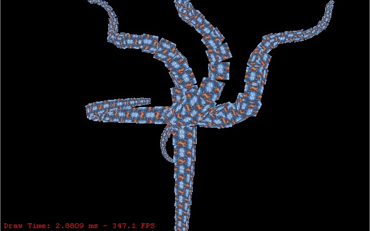

# SharpGL-Collection

A collection of interesting OpenGL programs converted in C# with SharpGL, not written by my, just converted to C#.

Metaballs

Environment Metaballs

Plasma Tunnel

Peristalis

Specular Torus

Tentacles

VSync Demo

